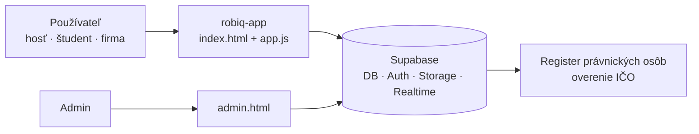

# Mapa systému Robiq

Robiq spája **študentov (brigádnikov)** s **firmami**, ktoré ponúkajú krátkodobú prácu na Slovensku.
Toto je vstupná stránka — odtiaľto sa dá preklikať všade.

> [!info] Čo tu je a čo nie
> Sú tu **poznámky o tom, ako systém funguje** — nie kód. Kód je v repozitári (`robiq-app/`, `supabase/`);
> poznámky naň len odkazujú. Ako s nimi pracovať: [[Ako pracovať s poznámkami]].

## Systém jednou vetou
Statická webová appka (HTML + JS, bez build kroku) beží na **Cloudflare** a všetky dáta, prihlásenie,
súbory a realtime chat má v **Supabase** (Frankfurt). Pravidlá „kto čo smie" sú priamo v databáze (RLS).

## Rozcestník

### Architektúra
- [[Architektúra]] — z čoho sa systém skladá, kde beží, ako sa nasadzuje
- [[app.js – mapa kódu]] — kde v hlavnom súbore čo nájdeš

### Databáza
- [[Dátový model]] — tabuľky a ich vzťahy
- [[Prístupy a bezpečnosť (RLS)]] — kto čo vidí a smie meniť
- [[Databázové funkcie]] — logika, ktorá beží v databáze (zhoda, párovanie, admin…)
- [[Migrácie – história]] — čo sa kedy menilo

### Toky (ako veci prebiehajú)
- [[Registrácia študenta]]
- [[Registrácia firmy a overenie IČO]]
- [[Prihlásenie a obnova hesla]]
- [[Záujem, zhoda a chat]] — jadro celej appky
- [[Upozornenia]] — push na telefón (a e-mail) pri novej zhode a správe
- [[Návrhy kandidátov (párovanie)]]
- [[Nahlásenia a moderovanie]]
- [[Zmazanie účtu]]
- [[Štatistika používania]]

### Obrazovky
- [[Obrazovky hosťa a študenta]]
- [[Obrazovky firmy]]
- [[Admin panel]]
- [[Chybové stránky]] — „Niečo sa pokazilo" a „Táto stránka neexistuje"

### Ostatné
- [[Slovník]] — pojmy (záujem, zhoda, oslovenie…)
- [[Otvorené otázky a nezrovnalosti]]
- Existujúce dokumenty: [[PLAN-parovanie-v2]], `supabase/UDAJE-INVENTAR.md`, `design_handoff_robiq/DESIGN.md`
