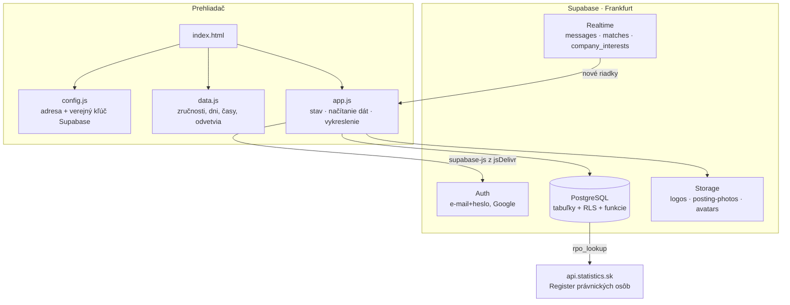

# Architektúra

← [[00 Mapa systému]]

## Súčasti

| Časť | Čo to je | Kde |
|---|---|---|
| **Appka** | jedna stránka (`index.html`), logika v `app.js`, statické zoznamy v `data.js`, vzhľad v `styles.css` | `robiq-app/` |
| **Admin** | samostatná stránka so štatistikou, firmami, inzerátmi a nahláseniami | `robiq-app/admin.html` → [[Admin panel]] |
| **Právne stránky** | podmienky, ochrana osobných údajov | `robiq-app/podmienky.html`, `ochrana-osobnych-udajov.html` |
| **Databáza** | PostgreSQL v Supabase — tabuľky, pravidlá prístupu, funkcie, triggery | `supabase/schema.sql` + migrácie |
| **Dizajn** | klikateľný prototyp a dizajnový systém (zadanie) | `design_handoff_robiq/` |
| **Lokálny server** | na spustenie appky na vlastnom počítači (Windows) | `tools/serve.ps1` → http://localhost:8765 |

## Ako to do seba zapadá

## Dôležité princípy
- **Žiadny vlastný backend.** Prehliadač hovorí priamo so Supabase. Bezpečnosť preto stojí na pravidlách v databáze → [[Prístupy a bezpečnosť (RLS)]].
- **Verejný kľúč (`anon`) v `config.js` je v poriadku** — sám nič nedovolí, všetko strážia RLS pravidlá. Kľúč `service_role` do appky nikdy nepatrí.
- **Citlivé operácie bežia v databáze** ako funkcie (`security definer`): vytvorenie zhody, návrhy kandidátov, overenie firmy, admin zásahy → [[Databázové funkcie]].
- **Guest-first:** ponuky vidí aj neprihlásený hosť; prihlásenie sa pýta až pri „Mám záujem".
- **Bez build kroku:** čo je v `robiq-app/`, to sa nasadí.

## Nasadenie
- Web beží na **Cloudflare** (projekt „robiq", Workers Builds). Pri každom pushi na GitHub Cloudflare spustí `wrangler`, ktorý podľa `wrangler.jsonc` nahrá statické súbory z `robiq-app/`. Bez tohto súboru build zlyhá („Missing entry-point… or assets directory").
- Push do `main` = nasadenie na web; push do inej vetvy = len náhľadová verzia.
- Bezpečnostné hlavičky sú v `robiq-app/_headers`.
- Neexistujúca adresa → `robiq-app/404.html` (nastavenie `not_found_handling` vo `wrangler.jsonc`); appka, ktorá sa nevie spustiť, ukáže „Niečo sa pokazilo" — [[Chybové stránky]].
- **Zmeny databázy sa nenasadzujú samy:** migráciu treba ručne spustiť v Supabase → SQL Editor → Run. Pozri [[Migrácie – história]].

## Externé služby
| Služba | Na čo |
|---|---|
| Supabase | databáza, prihlásenie, súbory, realtime — bezplatný plán: 200 prihlásených online naraz, 500 MB databáza, 5 GB prenos/mesiac, uspí sa po 7 dňoch bez aktivity |
| Google (OAuth) | prihlásenie cez Google |
| api.statistics.sk (RPO) | overenie IČO firmy |
| jsDelivr | knižnica supabase-js |
| cdnfonts.com | písma Satoshi a Open Sauce One |
| Anthropic (Claude) | **len test:** bot v registrácii rozhovorom — funkcia `ai-onboarding` → [[Registrácia rozhovorom s AI (test)]]; platí sa za použitie |
| Brevo | e-maily (potvrdenie registrácie, obnova hesla, upozornenia, hlásenie o páde) — bezplatne **300 e-mailov denne spolu**; pri raste prvý limit, na ktorý appka narazí |

Súvisí: [[app.js – mapa kódu]], [[Dátový model]]
