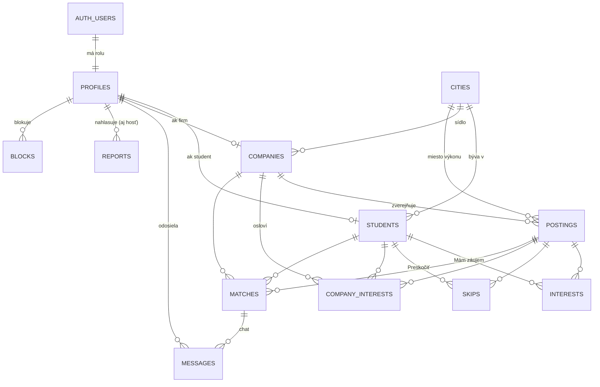

# Dátový model

← [[00 Mapa systému]] · zdroj pravdy: `supabase/schema.sql`

## Hlavná myšlienka
Každý používateľ má účet v `auth.users` (Supabase) a k nemu riadok v `profiles` s **rolou** — `student` alebo `firm`.
Podľa roly má ďalej riadok v `students` alebo `companies`. Firma zverejňuje `postings` (inzeráty).
Záujem z oboch strán vytvorí `matches` (zhodu) a v nej sa píšu `messages`.

## Tabuľky

| Tabuľka | Čo obsahuje | Kto ju vidí |
|---|---|---|
| `profiles` | rola používateľa | len vlastník |
| `students` | meno, zručnosti (s úrovňou), hodiny, dni a časy, dátum narodenia, mesto + dochádzanie, bio, cesta k fotke | len vlastník; firma časť cez funkciu |
| `companies` | zobrazovaný názov, **oficiálny názov z registra** (`legal_name`), IČO, odvetvia, kontaktná osoba, popis, logo, sídlo, **overená** | všetci (verejné) |
| `postings` | inzerát: názov, plat, počet miest (`need`/`taken`), typy, len 18+, mesto/remote, adresa, popis, poznámka pre AI, fotky, stav (`active`, `blocked`) | aktívne všetci |
| `interests` | študent → „Mám záujem" o inzerát | študent svoje, firma na svoje inzeráty |
| `skips` | študent → „Preskočiť" | len študent |
| `company_interests` | firma → oslovila študenta na konkrétny inzerát | firma svoje, študent o sebe |
| `matches` | zhoda (obojstranný záujem) — **vytvára ju len trigger** | obe strany |
| `messages` | správy v chate (1–2000 znakov) | obe strany zhody |
| `cities` | 143 slovenských miest s GPS | všetci |
| `blocks` | študent skryl firmu / firma zablokovala brigádnika | len ten, kto blokoval |
| `reports` | nahlásenia inzerátu / firmy / brigádnika | len admin (cez funkciu) |
| `events` | anonymná štatistika (názov udalosti, rola, čas) | len admin (cez funkciu) |
| `admins` | e-maily adminov | nikto priamo |

## Úložisko súborov (Storage)

| Bucket | Obsah | Verejný? |
|---|---|---|
| `logos` | logá firiem, `<uid>/logo.<ext>` | áno |
| `posting-photos` | fotky „deň v práci", `<uid>/<posting_id>/…`, max. 3 | áno |
| `avatars` | fotky brigádnikov, `<uid>/avatar.<ext>` | **nie** — firma dostane podpísané URL len pre svojich kandidátov |

## Dôležité detaily
- **Zručnosti** sú v `students.skills` ako JSON: `[{ n: "Barista", lvl: 1–3, speak: true }]`. Zoznam ponúkaných zručností je v `robiq-app/data.js` (`GROUPS`).
- **Hodiny** sú číslo 0–3 = index do zoznamu `HOURS` v `data.js` (5 h / 10 h / 20 h / fulltime cez leto).
- **Dochádzanie** (`commute`): `city` · `15km` · `30km` · `any`.
- **Dátum narodenia**: minimálne 16 rokov a raz nastavený sa nedá zmeniť (trigger `students_guard_birth`).
- `companies.verified` a `legal_name` si firma nemôže nastaviť sama — len funkcia overenia (trigger `companies_guard_verified`). Zmena IČO overenie zruší.
- `postings.blocked` môže meniť len admin (trigger `postings_guard_blocked`).
- `postings.taken` (obsadené miesta) = počet zhôd na inzerát, max. `need` — počíta ho trigger `matches_sync_taken`.
- `postings.views` = počet otvorení detailu (funkcia `count_view`, vlastné inzeráty firmy sa nepočítajú).
- Zmazanie používateľa v `auth.users` **kaskádovo** zmaže všetko jeho (profil, inzeráty, záujmy, zhody, správy).

Súvisí: [[Prístupy a bezpečnosť (RLS)]], [[Databázové funkcie]], [[Slovník]]
