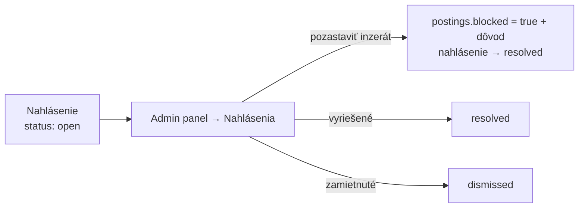

# Nahlásenia a moderovanie

← [[00 Mapa systému]] · tabuľka `reports` · kód: `app.js` → `reportPosting`, `reportChat`, `reportSend`

Mechanizmus oznamovania podľa **DSA čl. 16** — ktokoľvek (aj hosť) môže nahlásiť problém.

## Čo sa dá nahlásiť a odkiaľ
| Čo | Odkiaľ |
|---|---|
| inzerát | detail inzerátu (⚑) / menu karty |
| firmu | hlavička chatu (študent) |
| brigádnika | hlavička chatu / karta kandidáta (firma) |

Dôvody: podvod · nevhodný obsah · duplicita/spam · iné (+ voliteľná poznámka do 1000 znakov).

## Riešenie

- Pozastavený inzerát (`blocked`) firma vidí so značkou a dôvodom, ale **sama ho späť zapnúť nemôže**.
- Počet otvorených nahlásení svieti v admin paneli pri záložke.

Súvisí: [[Admin panel]]
