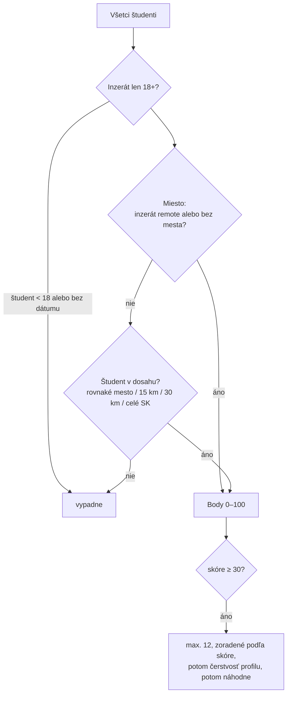

# Návrhy kandidátov (párovanie)

← [[00 Mapa systému]] · DB: `suggest_candidates` · kód: `app.js` → `loadSuggestions`, `suggCard` · plán: [[PLAN-parovanie-v2]]

Keď firma zverejní inzerát, databáza jej navrhne **až 12 vhodných študentov**. Návrhy sú **anonymné** —
firma vidí zručnosti, hodiny, dostupnosť, mesto/vzdialenosť a skóre, ale **nie meno ani fotku**.
Meno uvidí až keď študent sám dá „Mám záujem".

## Algoritmus (v2)

## Body (max. 100)
| Kritérium | Body |
|---|---|
| Zručnosti nájdené v texte inzerátu (názov, popis, poznámka pre AI, typy) | až 45 (1. zhoda 25, 2. 12, 3. 8) × úroveň (0,7 / 1 / 1,2) |
| Odvetvie firmy sedí so zručnosťou študenta | 15 |
| Dostupnosť vs. typ brigády (víkendy, poobede, večery, flexibilné) | až 25 |
| Miesto (rovnaké mesto 10, do 30 km 5, remote 5) | až 10 |
| Hodiny ≥ 10 h/týždeň | 5 |
| Čerstvosť profilu (do 30 dní 5, do 90 dní 2) | až 5 |

**Slovná zhoda** nie je AI: porovnáva sa prvých 5 písmen zručnosti bez diakritiky („barist" nájde „baristu").

## Poradie ponúk pre študenta (feed)
Zvlášť od návrhov pre firmu — v `app.js` → `remaining()`:
1. inzeráty, kde firma študenta **oslovila**,
2. inzeráty **v dosahu** (podľa mesta a dochádzania),
3. najnovšie.
Nič sa neskrýva, okrem preskočených, 18+ pre mladších a zablokovaných firiem. Hosť vidí ponuky v náhodnom poradí.

Súvisí: [[Záujem, zhoda a chat]], [[Obrazovky firmy]]
