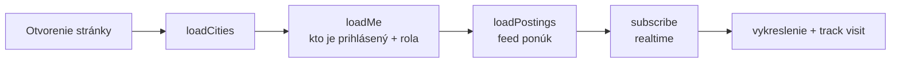

# Prihlásenie a obnova hesla

← [[00 Mapa systému]] · kód: `app.js` → objekt `go` (`doLogin`, `google`, `forgot`, `doReset`), `loadMe`, `enterApp`

## Spôsoby prihlásenia
- **E-mail + heslo** (Supabase Auth).
- **Google** — Supabase presmeruje na Google a späť; `loadMe` potom zistí, či už existuje profil. Ak nie, pokračuje sa registráciou (výber typu účtu).

## Čo sa deje pri štarte appky

- `loadMe` podľa roly zavolá `loadStudent` alebo `loadCompany` a overí, či je používateľ admin.
- Po odhlásení sa stav vymaže a zobrazí sa čistý pohľad hosťa.

## Zabudnuté heslo
1. Na prihlasovacej obrazovke „Zabudol som heslo" → Supabase pošle e-mail s odkazom.
2. Odkaz otvorí appku s `type=recovery` → obrazovka **reset** (nové heslo 2×, min. 6 znakov).
3. Po uložení sa používateľ prihlási do appky.

Súvisí: [[Registrácia študenta]], [[Registrácia firmy a overenie IČO]]
