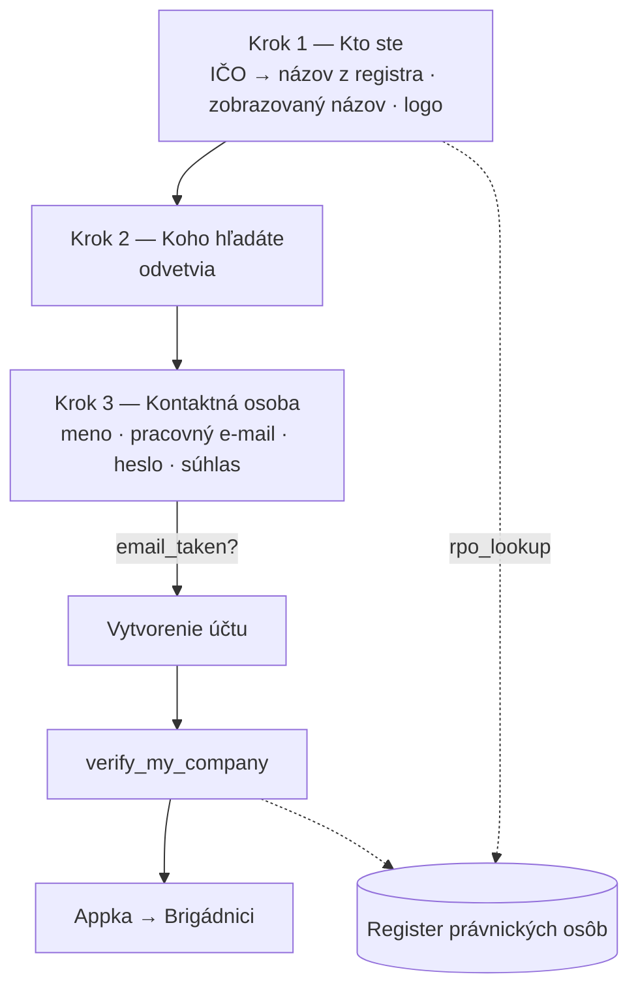

# Registrácia firmy a overenie IČO

← [[00 Mapa systému]] · kód: `app.js` → `renderFob`, `fobStep1–3`, `rpoLookup`, `verifyCompany`, `registerCompany`

Tri kroky (obrazovka `fob`).

## Overenie IČO
1. V kroku 1 appka zavolá `rpo_lookup(ičo)` → databáza sa spýta **api.statistics.sk** a vráti oficiálny názov a mesto.
2. Po vytvorení účtu `verify_my_company()` nastaví `companies.verified = true` a `legal_name` (oficiálny názov) — ak firma v registri existuje a nie je zaniknutá.
3. Na kartách inzerátov sa potom ukáže **„✓ Overená firma"**; v detaile inzerátu je oficiálny názov.

## Pravidlá
- **Dva názvy:** `name` si firma volí sama (značka, napr. „Kaviareň Test"), `legal_name` je z registra a firma ho meniť nemôže.
- `verified` si firma nevie nastaviť sama; **zmena IČO overenie zruší**.
- Ak register nedostupný → firma zostane neoverená; pri ďalšom prihlásení (`loadCompany`) sa overenie skúsi znova. V profile je aj tlačidlo „Overiť znova".
- Kroky sú bez nadpisov, vysvetľujúcich viet aj nápisu „krok 1 / 3" — rovno polia, priebeh ukazujú len bodky hore.
- Admin môže firmu overiť aj ručne → [[Admin panel]].

Súvisí: [[Registrácia študenta]], [[Obrazovky firmy]], [[Databázové funkcie]]
