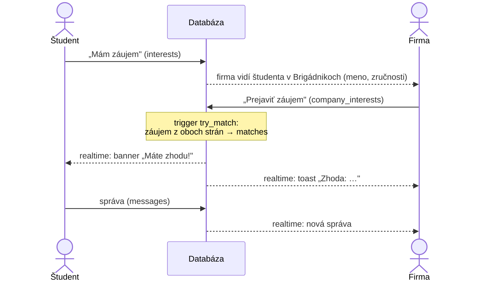

# Záujem, zhoda a chat

← [[00 Mapa systému]] · kód: `app.js` → `act`, `onNewMatch`, `subscribe`, `sendMsg` · DB: `try_match`

Toto je **jadro celej appky**. Zhoda (chat) vznikne, keď o seba prejavia záujem **obe strany na ten istý inzerát**.

## Dve cesty k zhode
1. **Študent prvý:** dá „Mám záujem" → firma ho uvidí v záložke Brigádnici → firma dá „Prejaviť záujem" → zhoda.
2. **Firma prvá (oslovenie):** firma v anonymných návrhoch osloví kandidáta → študentovi sa inzerát ukáže v Objavuj **na prvom mieste** + toast „Firma ťa oslovila" → študent dá „Mám záujem" → zhoda. Pozri [[Návrhy kandidátov (párovanie)]].

## Hosť
Hosť vidí ponuky, ale pri „Mám záujem" sa mu ukáže výzva na prihlásenie/registráciu (tzv. *gate*).
Inzerát si appka zapamätá a po prihlásení záujem odošle sama.

## Preskočiť
„Preskočiť" uloží riadok do `skips` a karta sa už neukáže. Keď študent všetko preskočí, môže dať „Prezrieť znova" (zmaže svoje skips).

## Realtime
Appka počúva na nové riadky v `messages`, `matches` a `company_interests` — bez obnovenia stránky.

Každý prihlásený počúva **len svoje** riadky — filter robí už server, nie appka:
- `messages` — len zo svojich chatov (`match_id` v zozname svojich zhôd; pri viac ako 100 chatoch bez filtra, kvôli limitu Supabase),
- `matches` — len kde je on študent / firma,
- `company_interests` — len oslovenia jeho samého (študent).

Prečo: predtým dostával každý všetky nové správy a zhody v appke a sám si vyberal svoje. Pri stovkách ľudí naraz by server kontroloval každú zmenu pre každého. Keď pribudne nová zhoda, appka si spojenie obnoví, aby chodili aj správy z nového chatu. Hostia (neprihlásení) nepočúvajú nič. Limit bezplatného plánu Supabase je **200 ľudí online naraz** — pozri [[Architektúra]].

## Chat
- Zobrazený v záložke **Správy** (študent aj firma, spoločná funkcia `chatUI`).
- Správa 1–2000 znakov; písať smie len účastník zhody.
- Z hlavičky chatu sa dá druhá strana **nahlásiť** → [[Nahlásenia a moderovanie]].

Súvisí: [[Slovník]], [[Prístupy a bezpečnosť (RLS)]]
