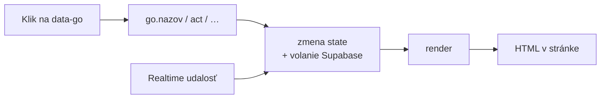

# app.js – mapa kódu

← [[00 Mapa systému]] · súbor: `robiq-app/app.js` (~2200 riadkov)

Nie je tu kód — len **kde čo hľadať**. Sekcie v súbore sú oddelené komentármi `// ═══════════ Názov ═══════════`.
Komentáre `l.123` odkazujú na riadky prototypu `design_handoff_robiq/Robiq MVP.dc.html`.

## Ako appka funguje (princíp)
Celá appka je jeden objekt **`state`**. Každá akcia zmení `state` a zavolá **`render()`**, ktoré prekreslí obrazovku.
Tlačidlá majú `data-go="nazov"` → spustí sa funkcia `go.nazov` a potom `render()`.

## Sekcie súboru (zhora nadol)
| Sekcia | Čo obsahuje | Kľúčové funkcie |
|---|---|---|
| State | počiatočný stav, `screen` = app · login · pick · ob · fob · reset; **prepínač registrácie** `REG_V2` (false = schovaná verzia 1) | `initialState`, `REG_V2` |
| Theme | svetlý/tmavý režim (localStorage) | `applyTheme` |
| Cities | zoznam miest, našepkávanie, vzdialenosť, dosah | `loadCities`, `cityAutocomplete`, `kmBetween`, `inReach` |
| Profile photos | fotky študentov (neverejný bucket) | `uploadAvatar`, `resolveAvatars` |
| Usage statistics | anonymné udalosti | `track` → [[Štatistika používania]] |
| Data: reading | načítanie dát zo Supabase | `loadPostings`, `loadMe`, `loadStudent`, `loadCompany`, `loadSuggestions`, `loadCandidates`, `loadMatches` |
| Realtime | počúvanie nových správ, zhôd, oslovení | `subscribe`, `onNewMatch` |
| Actions | záujem/preskočiť, vstup do appky, všetky tlačidlá | `act`, `enterApp`, objekt `go`, `sendMsg`, `saveStudent`, `saveCompany`, `uploadLogo` |
| — registrácia v2 | záujem hosťa čaká na účet (aj v prehliadači), čo študentovi chýba v profile | `pendingSave`/`pendingLoad`, `sendPending`, `openJoin`, `profileTodo`, `profilePct` → [[Registrácia študenta]] |
| — spoločné kroky | veci, ktoré robí viac tlačidiel rovnako | `resetToGuest` (odhlásenie aj zmazanie účtu), `reloadCompany`, `removeFolder`, `checkMatch`, `reachOut`, `openReport`, `openPick` |
| Render | vykreslenie obrazoviek | `render`, `renderApp`, `renderHeader` |
| — študent | Objavuj, Správy, Profil; upozornenia na nedoplnený profil | `feed`, `jobCard`, `todoNudge`, `feedEnd`, `zhody`, `profile`, `todoCard` → [[Obrazovky hosťa a študenta]] |
| — firma | Ponuka, Správy, Inzeráty, Nový, Profil | `brig`, `suggCard`, `candCard`, `fspravy`, `ponuky`, `nova`, `fprofil` → [[Obrazovky firmy]] |
| — spoločné | chat, dock (svietiaca záložka Profil), prekrývacie vrstvy (detail, gate, toast, banner, nahlásenie, mazanie) | `chatUI`, `updateDock`, `todoTab`, `layers`, `bindAppInputs` |
| OB | registrácia študenta: v2 jedna obrazovka; tá istá obrazovka slúži na „Doplniť profil" (kroky 2–3, `obFill`) | `renderOb`, `obJoin` (v2), `obStep1–3`, `bindStep1`, `leaveFill`, `registerStudent` → [[Registrácia študenta]] |
| Shared editors | editor zručností, miesta a dostupnosti (onboarding aj profil) | `skillsEditor`, `placeEditor`, `availabilityEditor` |
| FOB | registrácia firmy, overenie IČO | `renderFob`, `fobStep1–3`, `rpoLookup`, `verifyCompany`, `registerCompany` → [[Registrácia firmy a overenie IČO]] |
| Helpers | drobnosti (`esc` = ochrana pred vložením HTML) | `bindInput`, `esc` |
| Login background | animované bodky na prihlásení | `draw`, `loop` |
| Start | štart appky, obnova hesla | → [[Prihlásenie a obnova hesla]] |

## Ostatné súbory v `robiq-app/`
| Súbor | Obsah |
|---|---|
| `index.html` | kostra stránky, sekcie obrazoviek, načítanie skriptov |
| `data.js` | pevné zoznamy: zručnosti (`GROUPS`), úrovne, hodiny, dni, časy, odvetvia, typy brigád, záložky; **ikony** (`ICONS` + `icon()`, jedna sada pre celú appku) a farby log firiem |
| `config.js` | adresa Supabase + verejný kľúč |
| `styles.css` | vzhľad (farby ako premenné, tmavý režim cez `.theme-dark`) |
| `admin.html` | admin panel → [[Admin panel]] |
| `_headers` | bezpečnostné hlavičky (Cloudflare) |
| `manifest.webmanifest`, `icons/` | inštalácia ako appka na mobile (PWA) |

- **Chybové hlášky** — `skError` preloží anglické chyby zo Supabase a prehliadača (zlé heslo, nepotvrdený e-mail, veľa pokusov, výpadok siete…) do slovenčiny. Naše vlastné slovenské hlášky z databázy prejdú bez zmeny, ostatné nahradí všeobecná veta.
